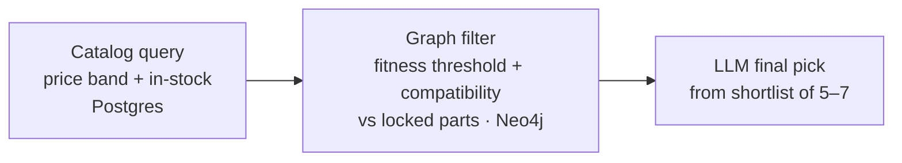

# Karma  — Agentic Workflow Design

> Living design document for the Karma ai recommendation pipeline (Karma Computers).
> **Status legend:** 🔒 Locked · 🛠️ Implemented · 🚧 In design · ❓ Open
> _Last updated: 2026-06-30_
>
> **Implementation status:** Phases 0–2 code-complete and merged to `main`. The full pipeline (Node 1 → Feasibility → Node 2 → Node 3 + refinement) is built, wired into a LangGraph `StateGraph`, and exercised by an integration test suite. Postgres (Session Pooler) and Neo4j (Enterprise edition, local Docker, seeded) are both live; all three compatibility families are enforced as hard filters. Remaining pre-production blocker: Neo4j needs migration off local Docker to a backend-reachable hosted instance. See §3, §9, §10.

---

## 1. System Overview

Karma AI is the multi-agent recommendation engine at the center of **Karma Computers**, a B2C e-commerce platform for PC parts and custom builds aimed at Indian consumers. It takes a user's needs expressed in natural language and produces a single, compatible, budget-fit PC build.

The pipeline is **design-first**: every agent is fully scoped and locked before implementation. It runs as a linear flow with one deterministic gate between intake and allocation.


---

## 2. Pipeline Architecture

### 2.1 Node One — Information Extraction Agent 🔒

- **Role:** Conversation-first intake. A set of **predefined, structured questions**, each answered by the user in a **freeform paragraph**. Not dropdowns, not open-ended free chat — fixed questions, paragraph answers.
- **Intake-model decision (conversation-first over wizard):** chosen deliberately. The build-requirement space is combinatorial and cannot be enumerated as wizard branches; conversation is the agentic thesis of the product; and the choice is **reversible** because both intake modes would produce the *identical* Brief — a guided wizard can be added later as additive front-end UI without touching any downstream node.
- **Question flow:**
  - **One question per turn**, but extraction is **opportunistic against the full Brief schema** — anything the user volunteers (even if it answers a later question) is captured immediately and the corresponding questions are skipped.
  - **Questions are static / predefined, not dynamically branched.** A user's answer never changes *which* questions are asked; it only affects downstream nodes. The sole exception is targeted **ask-if-ambiguous** clarifications (e.g. "video editing" → "which software?").
  - **Final question is open-ended**, asked after the others: *"any hard constraints / must-haves / must-nots?"* → populates the pinned `hard_constraints` block (`source: user_stated`).
- **Question set + stop condition:** there is **one finite, pre-prepared set of questions**. By default the agent works through the **entire set**, then locks the Brief — the list itself is the bound (no arbitrary max count). Two stop rules govern this:
  - **Required floor:** **budget + primary use case must be answered before proceeding.** This is the gate — intake cannot move past it without both.
  - **User early exit:** once the floor is met, if the user says "done" / "stop" at any point, intake ends there and the Brief locks immediately.
  - Otherwise (no early exit), every question in the pre-prepared set is asked. _(Supersedes the earlier "stops once budget + primary use case are filled" wording, and replaces the interim "max question count" idea — there is no count, only the fixed set + user stop.)_
- **Extraction + validation:** each paragraph answer → LLM returns JSON against the schema → **two-stage validation**: (1) JSON syntax (`JSON.parse`), (2) schema + enum conformance. Valid → merge into Brief. Malformed / non-conformant → retry then flag (exact retry policy deferred to testing).
- **Output:** Canonical **User Build Brief** JSON (full schema in **Appendix A**).
- **Not responsible for** feasibility or contradiction checking — Node One has no tier/benchmark data; its only jobs are asking questions and forming valid JSON. The Feasibility Check is the arbiter of buildability at budget.

### 2.2 Feasibility Check 🔒

**Role:** Lightweight pre-Node-Two gate. Answers one question before two more nodes run: *can the user's requirements be built within their budget?* Produces a rough estimate — no inventory search, no part selection, no compatibility validation. Those are Node Three's job.

**Three steps:**

1. **Requirements Resolver** — per `software` entry, look up base component floor (what GPU class, how much RAM, etc.), scale by the performance envelope (`resolution`, `framerate`, `hdr`), aggregate across the full workload:
   - GPU tier, CPU tier, VRAM: **max** across software (peak demand wins).
   - Storage: **additive** (workloads stack their capacity needs).
   - RAM: **max** single-app floor, plus a concurrency bump if two or more heavy workloads run simultaneously.
   - Hard constraints that raise the floor (e.g. SFF/ITX form factor, brand exclusions) are folded in here.
   - Reused parts: their cost is zeroed; their constraints (socket, form factor) remain live.

2. **Scope aggregator** — add non-component line-items depending on `budget.scope`: monitor (if unowned and in scope), OS license, must-have peripherals. Subtract reused-part costs.

3. **LLM-assisted cost estimate** — the LLM receives the aggregated floor, the full budget picture, and **one live price anchor pulled from Postgres**: the current minimum catalog price for the binding component (almost always the GPU; sometimes CPU for heavy compute workloads). The LLM reasons about the rest from general knowledge of Indian PC part pricing and returns a verdict with a brief reason.

**Verdict — three-state 🔒:**
- `comfortable` — budget has meaningful headroom above the estimated floor.
- `tight` — buildable but little flexibility; expect compromises.
- `impossible` — floor estimate materially exceeds the ceiling.

**Routing:** `comfortable` or `tight` → proceed to Node Two. `impossible` → Type Two failure: surface to the user with the binding constraint and suggested adjustments (raise budget, lower resolution target, relax form-factor constraint, etc.). Node One Brief is re-entered if the user adjusts.

**What this is not:** the Feasibility Check does not validate a complete build, does not search inventory, and does not pick parts. It is a rough gate — honest about the fact that it is an estimate.

**Known open items:** realistic-min buffer calibration; non-component cost estimates are currently rough; reused-parts compatibility stubs need PC-of-record data from `existing.existing_pc_build_id` (Brief Appendix A).

### 2.3 Node Two — Budget Allocation Agent 🔒

- **Role:** Takes three deterministically compiled, server-side inputs, reasons across them, and outputs price bands per component. No other responsibility.

**Deterministic pre-steps (before the agent runs):**
1. Generate the shopping list by cross-referencing the brief's existing/reused parts against the full component list — only components that need to be purchased proceed.
2. Subtract fixed costs (OS license, specified monitor, peripherals). Node Two only allocates the remaining **core-component pool**.

> The Brief now carries these fixed-cost inputs explicitly — `operating_system`, `monitor`, and `peripherals` sections (Appendix A) — which the fixed-cost subtraction reads.

**Three inputs:**
1. **Default allocation profile** — per-use-case skew predetermined by Karma Computers (gaming → GPU, editing → VRAM + storage, ML → RAM + GPU VRAM, programming → CPU + RAM).
2. **User brief** from Node One.
3. **Software minimum specs** fetched at runtime via web search from authoritative sources (Steam, Epic Games, official vendor pages). Not stored in the knowledge graph.

> **Boundary:** Catalog price floors are *not* a Node Two input. If Node Three can't find a part within a band, it surfaces that to the user — not Node Two's concern.

**Output:** JSON price bands (low / mid / high in INR) per shopping-list component only. Constraints:
- midpoints sum to the core budget target,
- high ends sum to the ceiling,
- low ends sum to the floor.

No rationale, flex flags, or metadata — Node Three has the full brief and derives intent itself. Node Three hunts for components clustered around the midpoints as the sweet spot.

### 2.4 Node Three — Part Finder & Recommender 🔒

**Selection sequence:** GPU → CPU → RAM → Storage → Motherboard → PSU → Case → Cooler → Fans.
_(Motherboard is selected after the performance anchors are locked — it's a compatibility hub, not a constraint driver.)_

**Per-slot selection loop (three-step funnel):**



- **Fitness thresholds** are derived once upfront by the LLM reading the brief, stored in build state, and not re-derived per slot.
- **Safeguards:**
  - Relaxation ladder for empty shortlists (widen band → lower fitness threshold → escalate).
  - Lookahead probes before locking anchor components to prevent downstream dead-ends.
  - Running budget-pool tracking to catch drift across slots.
  - Compatibility validator runs after every lock.
- **Build state carries:** locked parts, derived thresholds, remaining budget, user brief.
- **Output:** A single build (not multiple options). The **build card** is a human-readable summary of parts, prices, and justifications sent to the user for confirmation; product IDs are sent to the backend on confirmation.
- **Failure communication:** plain English (e.g., "your budget cannot support this configuration; either lower demands or increase budget; the best available within constraints is X").

**Refinement loop — Approach B (pin / open model):** 🛠️
- All slots re-solve on each refinement; the compatibility validator surfaces conflicts conversationally rather than maintaining a dependency graph.
- Budget-level changes are routed through the budget updater (re-run `allocate_budget` with the new budget, then re-solve).
- Brief-level changes restart at Node One.
- **As built (`node3_refinement.py`):** the conversation loop lives in `run_pipeline.py` (Phase 5, `run_refinement`); the module itself is pure and non-interactive. A freeform user message is parsed via `call_structured` into a `RefinementOps` — a **multi-op** classification (not a single action): `brief_edit`, `restart_trigger`, `budget_change`, `pin`, `reject`, `accept` may all populate in one turn (e.g. "bump budget to 90k and give me an nvidia card" → `budget_change` + `reject`).
  - **Field routing** (`route_field_edit`) is a fixed, hardcoded table — never an LLM judgment call: `software` / `performance` / `extras` / `physical` / `longevity` → **additive** (`brief_edit`); `primary_use_case` / `budget.scope` / `existing.reuse_parts` → **structural** (`restart_trigger`). A field outside the table defaults to additive with a logged warning, never a crash. The table decides routing even if the LLM puts a structural field name in `brief_edit` (or vice versa).
  - **List-valued additive fields merge, not replace:** `software` is upserted by name (`_merge_list_field`) rather than overwritten wholesale, since the LLM classifying one turn only sees that turn's message — asking it to echo the full existing list back would risk silently dropping entries it didn't mention.
  - **Dispatch precedence**, fixed per turn: `restart_trigger → brief_edit → budget_change → pin/reject → re-solve → accept`. `restart_trigger` patches the brief and calls `graph_runner.run_from_brief`, skipping every other op that turn; `locked_parts` and `rejected_parts` persist across it. `brief_edit` patches the brief and re-runs `estimate_feasibility` only (not full Node One) — an `impossible` verdict skips the re-solve. `budget_change` rescales `comfortable_min/max` proportionally, sets the new ceiling, and re-runs `allocate_budget`. `pin` records `locked_parts[slot] = product_id`; `reject` appends a `RejectedPart` and unpins that slot if it was pinned. Any of the above triggers one incumbent-biased re-solve (`_select_build_with_pins` + `diff_and_bias`); `accept` (only reachable if nothing else fired) ships `build_card.product_ids`.
  - **`diff_and_bias`** reconciles a fresh re-solve against the prior card: for each non-pinned slot whose pick changed, it keeps the OLD part if still valid (in the widened price band, not rejected, compatible with parts decided so far) — otherwise the new pick wins. Only genuine changes land in `BuildCard.changed_slots` (`{slot, old_product_id, new_product_id, reason}`), so the harness prints a diff instead of a full card each round.
  - `MAX_REFINEMENT_ROUNDS = 5`.

---

## 3. Knowledge Graph Design — Neo4j 🔒 🛠️

**Two edge families:**
1. **Compatibility family** — unweighted junction nodes. Components connect to shared spec nodes (sockets, chipsets) rather than directly to each other.
2. **Fitness family** — weighted edges encoding how well a component serves a specific use case (gaming, video editing, music production, etc.).

**Node taxonomy:** component · spec · use-case · performance · component-class.

**Key choices:**
- **One node per distinct product** (not per chip model) — board-partner variants can differ meaningfully in cooling, noise, and sustained performance.
- **Single database:** Neo4j handles both compatibility and fitness traversal. A Postgres/relational approach for compatibility was evaluated and rejected — the agentic system benefits from traversing both in the same semantic space without context switching. Compatibility edges are weightless but still traversed as graph relationships.

**As built:**
- `agents/db/neo4j_schema.py` — label constants (`COMPONENT`, `SPEC`, `USE_CASE`, `PERFORMANCE`, `COMPONENT_CLASS`), node-key constraints, indexes, and an idempotent `apply_schema(driver)`. Requires the **Enterprise** image (`neo4j:5-enterprise`, `NEO4J_ACCEPT_LICENSE_AGREEMENT=yes`) — Community fails silently on the first `NODE_KEY` constraint.
- `data/graph/seed_graph.py` — populates the graph from the Postgres catalog using `MERGE` throughout (idempotent). Creates `:Component` nodes; `[:BELONGS_TO]` → `:ComponentClass`; compatibility junctions (`:Spec` nodes for socket / DDR-gen / form-factor, with cooler `socket_compat`, motherboard `ddr_support`, case + motherboard `form_factor`, all read from the catalog `specs` JSONB); weighted `[:GOOD_FOR {weight}]` → `:UseCase` edges; and `[:HAS_VRAM {gb}]` → `:Performance` for GPUs.
- `agents/db/neo4j.py` — real parametrized Cypher (no f-strings): `compatibility_check(candidate_ids, locked_parts, candidate_slot)`, `fitness_filter(candidate_ids, use_case, threshold)` (fail-open — components with no `:GOOD_FOR` edge are kept, not dropped), `get_component_fitness(product_id, use_case)`, and `ping()` for availability detection.

**Live and enforced:** a Neo4j instance (Enterprise edition, local Docker) is stood up and seeded (103 products, 9 `ComponentClass`, 9 `Spec`, 5 `UseCase`, 4 `Performance` nodes + relationships); Node 3 detects it via `ping()`. All **three compatibility families — socket (CPU↔motherboard, cooler↔CPU), DDR generation (motherboard↔RAM), form factor (case↔motherboard)** — are hard-filtered: never bypassed by the price-band relaxation ladder, verified bidirectionally end-to-end. Node 3 additionally hard-filters the *resolved requirement floor* (VRAM / CPU tier / RAM & storage capacity / storage type) at the same catalog-query layer — see `agents/feasibility/catalog_floor.py`.

**Still open:** the `[:GOOD_FOR]` weights are a clearly-marked **STUB** table in `seed_graph.py` (sensible defaults, e.g. GPU→gaming 0.9, CPU→work 0.9) — real benchmark-sourced weights and the precise weight rubric remain deferred; this is unrelated to the compatibility enforcement above. Neo4j runs local Docker only — not yet migrated to a hosted instance reachable by a deployed backend (see §9).

---

## 4. Data Contracts (what moves where)

| Stage | Produces | Shape / notes |
|---|---|---|
| Node One | User Build Brief | JSON; budget + primary use case mandatory; now also carries software/workload, monitor, peripherals, storage, OS, existing/reused parts, and pinned `hard_constraints` — full schema in **Appendix A** |
| Feasibility Check | verdict + reason | `comfortable \| tight \| impossible`; comfortable/tight → proceed to Node Two; impossible → surface to user with binding constraint + suggested adjustments |
| Node Two pre-steps | shopping list + core budget pool | deterministic; fixed costs already subtracted |
| Node Two | price bands | JSON low/mid/high INR per shopping-list component |
| Node Three | build card | human-readable summary; product IDs sent to backend on confirm |

---

## 5. Platform Features 🔒

- **Hidden business-intelligence ranking layer** surfaces high-margin and overstock products without user visibility; admin-configurable via weight controls.
- **Access:** logged-in users only; 2–3 active chat cap (intentional funnel discipline); saved builds uncapped.
- **Two-tier memory:** long-term and short-term with auto-compaction. The durable build object stores product IDs and intent snapshots — **never prices**.
- **Tally ERP integration** via XML/ODBC for bidirectional stock and sales-voucher sync.

---

## 6. Decision Log — the *why*

| Decision | Reasoning |
|---|---|
| Conversation-first intake over guided wizard | Build-requirement space is combinatorial (can't enumerate branches); conversation is the agentic thesis; reversible since both modes emit the identical Brief, so a wizard can be added later as additive UI. |
| Structured questions, freeform paragraph answers | Keeps conversational feel while bounding each turn's scope — easier extraction, cleaner state, lower token use than reverse-engineering one long dump. |
| Static (non-branching) question set | Answers drive downstream nodes, not which questions are asked; avoids the wizard's hand-authored branch explosion. Only exception is ask-if-ambiguous clarifications. |
| Budget + primary use case as the proceed floor | With those two a build estimate is possible; they're the gate to proceed. Everything else is the rest of one fixed pre-prepared set, asked in full unless the user says "done" / "stop" (no arbitrary question cap). |
| Hard constraints captured via a final open-ended question + pinned block | Non-negotiables (no-RGB, SFF, brand bans) live in structured pinned state separate from the prose summary, so they survive compaction and are never re-suggested. |
| Node One does no feasibility/contradiction check | It has no tier/benchmark data; its only jobs are asking and forming valid JSON. Feasibility Check is the arbiter. |
| Motherboard selected after GPU/CPU/RAM | Prevents over-constraining the build; the board adapts to anchors rather than driving them. |
| Fitness thresholds derived once upfront | Avoids redundant per-slot LLM calls; thresholds live in build state. |
| Product-level graph nodes | Board-partner variants of the same chip differ enough in real-world performance to warrant individual nodes. |
| Catalog price floors excluded from Node Two | Allocation reasoning is Node Two's job; finding parts within bands is Node Three's. |
| Neo4j over Postgres for compatibility | Same-semantic-space traversal is worth the architectural simplicity; weightless edges are still valid graph relationships. |
| RAG over fine-tuning | Fine-tuning can't track volatile daily Indian pricing, goes stale on hardware launches, and is a black box. |
| Feasibility Check is LLM-assisted, not LLM-free | Pure determinism would require a complete inventory search to price the floor accurately — that is Node Three's job, not a gate's. An LLM call with one live Postgres price anchor (cheapest binding component) is fast, honest about being a rough estimate, and avoids pulling inventory logic into the wrong stage. |
| Feasibility Check does not search inventory | Finding and validating parts is Node Three's responsibility. The gate only answers "is this roughly buildable in budget?" — not "which parts?" Keeping the boundary clean prevents two nodes doing the same work. |
| One live price anchor (Postgres) injected into the LLM prompt | Indian PC pricing is volatile. The GPU — the most expensive and most volatile component — is anchored to the current catalog minimum price so the estimate doesn't go stale on the one number that matters most. Everything else the LLM reasons about from general knowledge. |
| Supabase as managed Postgres host (not full BaaS) | Fastify handles the API layer, Prisma the ORM. Does not replace Neo4j, Redis, or Meilisearch. |

---

## 7. Phase 1 Implementation Notes 🛠️

### 7.1 LLM Provider

DESIGN.md specifies the **Anthropic Claude API**; Phase 1 implementation uses **OpenAI `gpt-4o-mini`**. The model is configurable via the `OPENAI_MODEL` environment variable.

### 7.2 Conversation Loop Architecture

Node 1 does **not** own the conversation loop. The CLI harness (`run_pipeline.py`) drives the loop turn-by-turn. Node 1 exposes a stateless API:

- `blank_brief()` — returns an empty Brief skeleton.
- `floor_met(brief)` — returns True when the proceed gate is satisfied.
- `next_question(brief, asked_so_far)` — returns the next question string, or `None` when all questions are exhausted.
- `extract_turn(answer, brief, history)` — runs LLM extraction for one turn and returns the updated Brief.
- `newly_filled_sections(old_brief, new_brief)` — diff helper for reporting what changed.

This keeps Node 1 stateless and independently testable.

### 7.3 LLM Arithmetic Constraint — Locked Decision 🔒

Asking the LLM to produce exact INR band values across nine component slots fails arithmetic constraints reliably.

**Locked pattern:** the LLM produces **relative weights only** → Python computes INR values deterministically using **largest-remainder normalization** on 500-INR tokens. Sums hold by construction, not by asking the LLM to do arithmetic. `_distribute()` and `_compute_bands()` in `node2_allocation.py` implement this.

### 7.4 Feasibility Check — Live Price Anchor

One live Postgres price anchor (cheapest in-stock GPU from the catalog) is injected into the LLM prompt. Without it, verdicts are pessimistic — the model over-estimates GPU cost using stale priors.

- The Supabase **direct host** (`db.<ref>.supabase.co`) is retired; the **Session Pooler URL** must be used.
- `get_min_catalog_price` returns `0` on DB failure; `estimate.py` flags the anchor as `UNAVAILABLE` in the prompt and continues rather than aborting.

### 7.5 Software Extraction — Intensity/Frequency Rules 🔒

Default `gpt-4o-mini` behaviour marks all software as moderate intensity and ignores stated primary/secondary use-case priority when assigning frequency. Explicit prompt rules are required.

**Locked rules added to `_EXTRACT_SYSTEM`:**
- AAA titles and local LLMs → `heavy` intensity.
- Frequency derives from stated use-case priority, not software count.

### 7.6 floor_met() Definition

DESIGN.md defines the proceed floor as *budget + primary_use_case*. The implementation relaxes the budget side to match what the Brief actually captures:

- **Gate condition:** `comfortable_max > 0` **AND** `primary_use_case` non-empty.
- `sub_case` is **not** required for floor — it is optional metadata.

---

## 8. Phase 2 Implementation Notes 🛠️

### 8.1 Node 3 — Part Finder (as built)

`agents/nodes/node3_selector.py` implements the three-step funnel:

- `derive_fitness_thresholds(brief)` — **one** upfront `call_structured` call returning a per-slot threshold dict (stored in build state, never re-derived per slot). This call uses a **stronger model** (`gpt-4o` via `KARMA_THRESHOLD_MODEL`) because the per-slot reasoning quality drives every downstream pick; the per-slot final pick stays on `gpt-4o-mini`.
- `select_part(slot, band, brief, locked_parts, fitness_thresholds, neo4j_available)` — Step 1 Postgres `get_parts_in_band` (with one 20%-band-widening retry on empty); Step 2 Neo4j `compatibility_check` then `fitness_filter` (skipped when `neo4j_available` is False); Step 3 `call_structured` final pick from a shortlist capped at 7.
- `select_build(brief, price_bands)` — walks `SELECTION_ORDER` (GPU → CPU → RAM → Storage → Motherboard → PSU → Case → Cooler → Fans), skips `reuse_parts` with `action == "keep"`, tracks running budget, runs a motherboard lookahead probe after GPU+CPU lock, and re-validates compatibility after each lock.
- **Graceful degradation (verified):** with Neo4j down *and* Postgres unreachable, `select_build` walks all nine slots, never crashes, and returns an empty `BuildCard` (every slot `None`). This is the designed degraded path — the funnel is structurally correct; only live data is missing.

### 8.2 LangGraph Wiring

`agents/graph.py` compiles a `StateGraph` matching the §1 flowchart: `node_intake → node_feasibility → {node_allocate → node_select → END | node_surface_failure → END}`, with conditional routing on the feasibility verdict. All node imports are **defensive** (`try/except ImportError`) so the graph compiles even if a downstream module is absent. `node_intake` is **one turn only** — designed for checkpointer resumption; the conversation loop still lives in `run_pipeline.py`, which remains the CLI driver. `agents/graph_runner.py` exposes `run_from_brief(brief, price_bands) -> PipelineState` for fixture/API invocation, pre-seeding state and entering at `node_feasibility`. This is the entry point the future API layer will call.

`PipelineState` (`agents/state/pipeline_state.py`) was extended with `fitness_thresholds`, `locked_parts` (string slot names → product_id), `remaining_budget`, and `error_message`. **Note:** `locked_parts` keys are **string slot names**, not `ComponentSlot` enums, to keep the graph-state contract serializable.

### 8.3 Output Formatter

`agents/output/formatter.py` centralizes all user-facing text: `format_build_card`, `format_price_bands` (byte-identical to the harness's inline printer, a drop-in import), `format_impossible` (numbered adjustment list), and `format_tight_warning`. Not yet wired into `run_pipeline.py` — that's a one-import swap remaining.

### 8.4 Integration Test Suite

`tests/test_pipeline_integration.py` + `conftest.py` (pytest). Deterministic allocation-sum assertions pass for all three fixtures (mids→target, highs→ceiling, exact by construction); storage-exclusion and fixed-cost checks pass. Feasibility tests **skip cleanly** when Postgres is unavailable via a `db_available` session fixture. Current result: **8 passed, 2 skipped**.

### 8.5 Model Allocation Policy 🔒

| Call | Model | Reason |
|---|---|---|
| Node 1 extraction | `gpt-4o-mini` | Schema-constrained, prompt does the work |
| Feasibility verdict | `gpt-4o-mini` | Single verdict, well-prompted |
| Node 2 allocation skew | `gpt-4o-mini` | Weights only; Python does the math |
| **Node 3 fitness thresholds** | **`gpt-4o`** | Multi-slot reasoning; quality drives all picks |
| Node 3 final part pick | `gpt-4o-mini` | Constrained shortlist with explicit specs |
| Node 3 refinement parse | `gpt-4o-mini` | Freeform → structured action |

Rule of thumb: tasks requiring **reasoning about tradeoffs across multiple dimensions without explicit scaffolding** get `gpt-4o`; **schema-constrained or prompt-scaffolded** tasks stay on `gpt-4o-mini`.

---

## 9. Open Questions / On the Horizon 🚧

**Completed since last revision** (moved out of this list): Neo4j schema + seed script, Cypher query patterns, Node 3 selection funnel, Node 3 refinement loop, LangGraph wiring, output formatter, integration test suite.

**Immediate (environment, not code):**
- ~~**Supabase connection**~~ ✅ RESOLVED — `POSTGRES_URL` uses the Session Pooler URL; verified live via `python -m scripts.test_db_connection`.
- ~~**Stand up + seed Neo4j**~~ ✅ RESOLVED — Enterprise edition, local Docker, seeded; all three compatibility families enforced (§3). Remaining: migrate off local Docker to a backend-reachable hosted instance (e.g. Aura) — infra is not yet reachable by a deployed backend.

**Small wiring remaining:**
- Swap `run_pipeline.py`'s inline price-band printer for `agents.output.formatter.format_price_bands`.
- Call `refinement_loop` after `select_build` in `run_pipeline.py` before final confirmation.

**Still genuinely open:**
- **Fitness weights (❓):** precise decimals vs coarse buckets? Scope `good_for` weights to use-case alone, or use-case + resolution-tier pairs? Current values are STUB defaults in `seed_graph.py`; real benchmark sourcing pending.
- **Business-intelligence ranking layer (§5):** hidden margin/overstock weighting injected into Node 3's final-pick prompt; admin-configurable weights. Designed, not built — first real Phase 3 task.
- **API layer:** `graph_runner.run_from_brief` is ready; needs a Fastify/FastAPI wrapper to expose it as an endpoint.
- **Feasibility Check — remaining open items:** realistic-min buffer calibration (headroom separating tight from comfortable); non-component cost estimates (currently rough STUB floor values); reused-parts compatibility stubs (need PC-of-record data from `existing.existing_pc_build_id`).
- **Node One retry policy:** exact malformed/non-conformant retry count and escalation path — deferred to testing.
- **Context window management strategy:** flagged as its own dedicated session topic.

---

## 10. Tech Stack

| Layer | Planned | As built (Phase 0–2) |
|---|---|---|
| AI API | Anthropic Claude API (tool calling) | **OpenAI** `gpt-4o-mini` default, `gpt-4o` for fitness thresholds (`KARMA_THRESHOLD_MODEL`); shared wrapper in `agents/llm/client.py` |
| Pipeline orchestration | — | **LangGraph** `StateGraph` (`agents/graph.py`) |
| Relational DB / product catalog | Supabase (managed Postgres) | Supabase Postgres via `psycopg2` `ThreadedConnectionPool` (`agents/db/postgres.py`); **direct host retired → Session Pooler required** |
| ORM | Prisma | not yet in the Python pipeline (raw SQL via psycopg2) |
| API layer | Fastify | not yet built; `graph_runner.run_from_brief` is the ready entry point |
| Knowledge graph | Neo4j | schema + client + seed implemented; **no live instance seeded yet** |
| Schema validation | — | **Pydantic v2** throughout |
| Session / short-term memory | Redis | not yet wired |
| Product search | Meilisearch | not yet wired |
| ERP integration | Tally ERP via XML/ODBC | not yet wired |
| Software specs retrieval | Runtime web search (Steam, Epic, vendor pages) | currently a clearly-marked STUB dict in Node 2 |
| Testing | — | **pytest** integration suite (`tests/`) |

---

## Appendix A — User Build Brief schema 🔒

The single structured artifact Node One emits and every downstream stage reads. A **living object**, re-filled in place on send-back / build-edit. **No prices stored.**

**Conventions**
- **Every field carries a `source` flag:** `user_stated | inferred | default_applied | skipped_by_user` — so any node can tell a real answer from an assumption, and re-engagement can target only `inferred` / `skipped` fields.
- **Field tiers:** `required` (blocks lock — the must-ask budget + primary use case), `ask_if_ambiguous`, `optional` (skippable → explicit default).
- **Soft vs hard:** preference fields (purpose, physical, longevity, extras) are soft signals the LLM weighs; the `hard_constraints` block is non-negotiable, **pinned, and never compacted**.

```yaml
# 0 — Envelope
brief_id, user_id, chat_id, build_id, schema_version
status: draft | locked | revisiting
completeness: { required_complete: bool, optional_filled: int, optional_skipped: int }
open_questions: [string]            # drives follow-ups
created_at, updated_at

# 1 — Budget (REQUIRED)
budget:
  currency: INR
  comfortable_min: int
  comfortable_max: int
  ceiling: int                      # max stretch
  scope: pc_only | pc_plus_monitor | pc_plus_peripherals | full_setup
  notes: string | null

# 2 — Purpose (REQUIRED)
purpose:
  primary_use_case: gaming | content_creation | work_productivity | storage_homeserver | general_use
  sub_case: string                  # competitive_fps | open_world_aaa | video_editing | 3d_modeling | music_production | ...
  secondary_use_cases: [ { use_case, weight: low|medium|high } ]

# 3 — Software & workload  — drives requirement floors at the feasibility gate
software:
  - name: string                    # "Red Dead Redemption 2", "Premiere Pro", "Blender", "VS Code"
    category: game | video | 3d | audio | dev | other
    frequency: primary | secondary | occasional
    intensity: casual | moderate | heavy

# 4 — Performance targets (required for gaming, else optional)
performance:
  target_resolution: 1080p | 1440p | 4K | null
  target_framerate: int | "max"
  hdr_wanted: bool                  # default false
  source: <flag>

# 5 — Monitor (single source of truth)
monitor:
  owned: yes | no
  owned_specs: { resolution, refresh_hz, hdr, size_inch } | null   # if owned
  target_specs: { resolution, refresh_hz, hdr } | null             # if not owned and in scope
  count: int                        # default 1
  source: <flag>

# 6 — Peripherals (meaningful only when budget.scope includes peripherals)
peripherals:
  - type: keyboard | mouse | headset | mic | speakers | drawing_tablet | controller | webcam
    requirements: string | null     # "mechanical, low-latency", "high DPI wireless"
    priority: must_have | nice_to_have

# 7 — Storage (Node Two must size this)
storage:
  capacity_gb: int | null
  speed_tier: nvme | sata_ssd | hdd | mixed
  data_profile: cold | warm | hot | mixed
  source: <flag>

# 8 — Operating system (real budget line + affects part selection)
operating_system:
  os: windows | linux | dual_boot | none_reuse
  license: oem | retail | byo | na
  source: <flag>

# 9 — Existing assets & ecosystem (REQUIRED to ask)
existing:
  has_existing_parts: yes | no
  reuse_parts: [ { slot, identifier, action: keep|replace } ]
  existing_pc_build_id: uuid | null # PC-of-record for upgrades
  ecosystem_prefs: { cpu_brand_pref, gpu_brand_pref }   # SOFT

# 10 — Physical & environment (optional → defaults)
physical:
  form_factor_pref: full_tower | atx_mid | compact_matx | sff_itx | no_preference
  noise_tolerance: silent_priority | balanced | dont_care
  placement: open_desk | enclosed_cabinet | hot_room | normal
  portability_need: bool
  size_notes: string | null

# 11 — Reliability & longevity (optional → defaults)
longevity:
  reliability_priority: consumer | high_stability_alwayson | mission_critical
  upgrade_path: future_proof | balanced | set_and_forget
  timeline: buy_now | flexible_for_deals

# 12 — Aesthetics & extras (optional → defaults)
extras:
  rgb_pref: want_rgb | minimal | none | no_preference
  visual_style: showcase_glass | clean_sleeper | no_preference
  connectivity_needs: [wifi | bluetooth | thunderbolt | 10gbe | many_usb]
  specific_part_requests: [ { slot, requested } ]   # SOFT, validated vs live stock

# 13 — Hard constraints (PINNED, never compacted, append-only unless retracted)
hard_constraints:
  must_have:   [ { id, type, value, source: user_stated|derived, locked_at } ]
  must_not:    [ { id, type, value, source, locked_at } ]
  rejected_parts: [ { product_id, reason, rejected_at } ]   # Node Three must never re-surface
```

**Consumer map**

| Stage | Reads |
|---|---|
| Feasibility Check | budget, purpose, software, performance, hard_constraints (size/form-factor raise the floor) |
| Node Two | budget, full purpose, software, performance, monitor + peripherals + OS (fixed-cost subtraction), existing.reuse_parts, longevity, hard_constraints |
| Node Three | everything — esp. software, ecosystem_prefs, extras, connectivity, hard_constraints, rejected_parts, reuse_parts |

**Mutability / re-fill rules**
- Reloaded and updated in place on send-back; `status → revisiting`, `open_questions` repopulated.
- Required fields may be revised but are never null once locked.
- `hard_constraints` accumulate across the session (append-only unless retracted) and are the one block guaranteed to survive compaction.
- Editing a saved build seeds a fresh Brief from the build's `intent_snapshot` + part list.
- A skipped optional field is recorded as `source: default_applied` (or `skipped_by_user`) — never silently assumed.

---

## Appendix B — Repository Map (as built)

```
karma ai/
├── run_pipeline.py                 # CLI driver; owns the conversation loop; --fixture / --fixture-all
├── requirements.txt                # openai, langgraph, pydantic, psycopg2-binary, neo4j, ...
├── agents/
│   ├── llm/client.py               # call_structured / call_text / StructuredCallError (OpenAI wrapper)
│   ├── graph.py                    # LangGraph StateGraph (karma_graph)
│   ├── graph_runner.py             # run_from_brief(brief, price_bands) — API/fixture entry
│   ├── state/pipeline_state.py     # PipelineState TypedDict + new_state()
│   ├── schemas/                    # source_flag, slots (ComponentSlot — canonical), brief,
│   │                               #   feasibility, price_bands, build_card
│   ├── nodes/
│   │   ├── node1_intake.py         # blank_brief, floor_met, next_question, extract_turn, ...
│   │   ├── node2_allocation.py     # allocate_budget; _distribute / _compute_bands (largest-remainder)
│   │   ├── node3_selector.py       # derive_fitness_thresholds, select_part, select_build, SELECTION_ORDER
│   │   └── node3_refinement.py     # RefinementOps, route_field_edit, dispatch_refinement, diff_and_bias
│   ├── feasibility/
│   │   ├── resolver.py             # resolve_requirements + aggregate_scope (deterministic)
│   │   └── estimate.py             # estimate_feasibility (LLM + live Postgres price anchor)
│   ├── db/
│   │   ├── postgres.py             # PostgresClient, get_min_catalog_price, get_parts_in_band
│   │   ├── neo4j.py                # ping, compatibility_check, fitness_filter, get_component_fitness
│   │   └── neo4j_schema.py         # constraints + indexes + apply_schema
│   └── output/formatter.py         # format_build_card / price_bands / impossible / tight_warning
├── data/
│   ├── catalog/seed.sql            # catalog table (9 categories, INR prices, in_stock, specs JSONB)
│   ├── fixtures/                   # budget_gamer / video_editor / ml_workstation (valid Briefs)
│   └── graph/seed_graph.py         # seeds Neo4j from the Postgres catalog (idempotent MERGE)
├── scripts/test_db_connection.py   # self-service Supabase connection + catalog verifier
└── tests/                          # conftest.py + test_pipeline_integration.py + test_node3_selector.py
                                     #   + test_graph_node_select.py + test_node3_refinement.py (pytest)
```

**Git workflow:** feature branches `phase{N}/feature-name`, conventional commits, PRs merged to `main`. Always stage with specific paths (`git add "karma ai/agents/..."`), never `git add .` — the repo root accumulates Node/`__pycache__`/stray files that `.gitignore` now covers. Always merge with `git merge <branch> -m "..."` to avoid the editor opening.

---