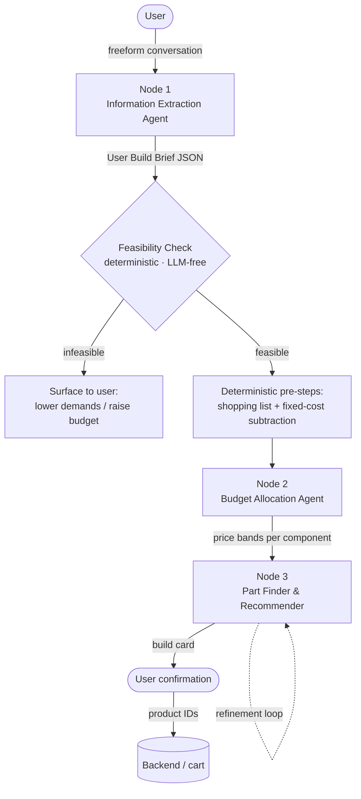
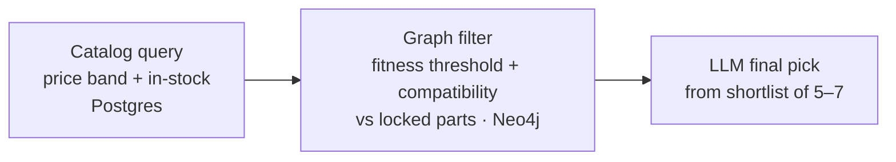

# Karma Advisor — Agentic Workflow Design

> Living design document for the Karma Advisor recommendation pipeline (Karma Computers).
> **Status legend:** 🔒 Locked · 🛠️ Implemented · 🚧 In design · ❓ Open
> _Last updated: 2026-06-26_

---

## 1. System Overview

Karma Advisor is the multi-agent recommendation engine at the center of **Karma Computers**, a B2C e-commerce platform for PC parts and custom builds aimed at Indian consumers. It takes a user's needs expressed in natural language and produces a single, compatible, budget-fit PC build.

The pipeline is **design-first**: every agent is fully scoped and locked before implementation. It runs as a linear flow with one deterministic gate between intake and allocation.

---

## 2. Pipeline Architecture

### 2.1 Node One — Information Extraction Agent 🔒

- **Role:** Conversation-first intake. Structured questions are answered in freeform paragraphs; one question per turn with opportunistic schema extraction.
- **Stops** once budget + primary use case are filled.
- **Output:** Canonical **User Build Brief** JSON.
- **Not responsible for** feasibility or contradiction checking — that is a downstream concern.

### 2.2 Feasibility Check 🛠️ (implemented)

- Deterministic, **LLM-free** Python package — 8 files, 11 passing tests.
- Uses Postgres for compatibility via shared category-ID matching and numeric fit comparisons.
- Computes two cost numbers:
  - **Lower bound** — gates the impossible.
  - **Realistic minimum** — gates the uncomfortable.
- **Known placeholders (flagged):** realistic-min buffer, hardcoded non-component costs, reused-parts compatibility stubs.

### 2.3 Node Two — Budget Allocation Agent 🔒

- **Role:** Takes three deterministically compiled, server-side inputs, reasons across them, and outputs price bands per component. No other responsibility.

**Deterministic pre-steps (before the agent runs):**
1. Generate the shopping list by cross-referencing the brief's existing/reused parts against the full component list — only components that need to be purchased proceed.
2. Subtract fixed costs (OS license, specified monitor, peripherals). Node Two only allocates the remaining **core-component pool**.

**Three inputs:**
1. **Default allocation profile** — per-use-case skew predetermined by Karma Computers (gaming → GPU, editing → VRAM + storage, ML → RAM + GPU VRAM, programming → CPU + RAM).
2. **User brief** from Node One.
3. **Software minimum specs** fetched at runtime via web search from authoritative sources (Steam, Epic Games, official vendor pages). Not stored in the knowledge graph.

> **Boundary:** Catalog price floors are *not* a Node Two input. If Node Three can't find a part within a band, it surfaces that to the user — not Node Two's concern.

**Output:** JSON price bands (low / mid / high in INR) per shopping-list component only. Constraints:
- midpoints sum to the core budget target,
- high ends sum to the ceiling,
- low ends sum to the floor.

No rationale, flex flags, or metadata — Node Three has the full brief and derives intent itself. Node Three hunts for components clustered around the midpoints as the sweet spot.

### 2.4 Node Three — Part Finder & Recommender 🔒

**Selection sequence:** GPU → CPU → RAM → Storage → Motherboard → PSU → Case → Cooler → Fans.
_(Motherboard is selected after the performance anchors are locked — it's a compatibility hub, not a constraint driver.)_

**Per-slot selection loop (three-step funnel):**

- **Fitness thresholds** are derived once upfront by the LLM reading the brief, stored in build state, and not re-derived per slot.
- **Safeguards:**
  - Relaxation ladder for empty shortlists (widen band → lower fitness threshold → escalate).
  - Lookahead probes before locking anchor components to prevent downstream dead-ends.
  - Running budget-pool tracking to catch drift across slots.
  - Compatibility validator runs after every lock.
- **Build state carries:** locked parts, derived thresholds, remaining budget, user brief.
- **Output:** A single build (not multiple options). The **build card** is a human-readable summary of parts, prices, and justifications sent to the user for confirmation; product IDs are sent to the backend on confirmation.
- **Failure communication:** plain English (e.g., "your budget cannot support this configuration; either lower demands or increase budget; the best available within constraints is X").

**Refinement loop — Approach B (pin / open model):**
- All slots re-solve on each refinement; the compatibility validator surfaces conflicts conversationally rather than maintaining a dependency graph.
- Budget-level changes are routed through the budget updater (Approach A tier routing).
- Brief-level changes restart at Node One.

---

## 3. Knowledge Graph Design — Neo4j 🔒

**Two edge families:**
1. **Compatibility family** — unweighted junction nodes. Components connect to shared spec nodes (sockets, chipsets) rather than directly to each other.
2. **Fitness family** — weighted edges encoding how well a component serves a specific use case (gaming, video editing, music production, etc.).

**Node taxonomy:** component · spec · use-case · performance · component-class.

**Key choices:**
- **One node per distinct product** (not per chip model) — board-partner variants can differ meaningfully in cooling, noise, and sustained performance.
- **Single database:** Neo4j handles both compatibility and fitness traversal. A Postgres/relational approach for compatibility was evaluated and rejected — the agentic system benefits from traversing both in the same semantic space without context switching. Compatibility edges are weightless but still traversed as graph relationships.

**Pending (next session):** Cypher query patterns, schema implementation, benchmark data sourcing, weight rubric design.

---

## 4. Data Contracts (what moves where)

| Stage | Produces | Shape / notes |
|---|---|---|
| Node One | User Build Brief | JSON; budget + primary use case mandatory; includes existing/reused parts |
| Feasibility Check | feasible / infeasible + cost bounds | lower bound (impossible) + realistic minimum (uncomfortable) |
| Node Two pre-steps | shopping list + core budget pool | deterministic; fixed costs already subtracted |
| Node Two | price bands | JSON low/mid/high INR per shopping-list component |
| Node Three | build card | human-readable summary; product IDs sent to backend on confirm |

---

## 5. Platform Features 🔒

- **Hidden business-intelligence ranking layer** surfaces high-margin and overstock products without user visibility; admin-configurable via weight controls.
- **Access:** logged-in users only; 2–3 active chat cap (intentional funnel discipline); saved builds uncapped.
- **Two-tier memory:** long-term and short-term with auto-compaction. The durable build object stores product IDs and intent snapshots — **never prices**.
- **Tally ERP integration** via XML/ODBC for bidirectional stock and sales-voucher sync.

---

## 6. Decision Log — the *why*

| Decision | Reasoning |
|---|---|
| Motherboard selected after GPU/CPU/RAM | Prevents over-constraining the build; the board adapts to anchors rather than driving them. |
| Fitness thresholds derived once upfront | Avoids redundant per-slot LLM calls; thresholds live in build state. |
| Product-level graph nodes | Board-partner variants of the same chip differ enough in real-world performance to warrant individual nodes. |
| Catalog price floors excluded from Node Two | Allocation reasoning is Node Two's job; finding parts within bands is Node Three's. |
| Neo4j over Postgres for compatibility | Same-semantic-space traversal is worth the architectural simplicity; weightless edges are still valid graph relationships. |
| RAG over fine-tuning | Fine-tuning can't track volatile daily Indian pricing, goes stale on hardware launches, and is a black box. |
| Determinism at the feasibility gate | Avoids non-determinism at the gate. Constraint-satisfaction minimum-cost computation is correct; greedy column-minima is not. |
| Supabase as managed Postgres host (not full BaaS) | Fastify handles the API layer, Prisma the ORM. Does not replace Neo4j, Redis, or Meilisearch. |

---

## 7. Open Questions / On the Horizon 🚧

- **Knowledge graph (next session):** Cypher query patterns, Neo4j schema implementation, benchmark data sourcing, weight rubric design.
- **Fitness weights (open ❓):** precise decimals vs coarse buckets? Scope `good_for` weights to use-case alone, or use-case + resolution-tier pairs?
- **Node Three refinement loop:** implementation.
- **Feasibility placeholders to resolve:** realistic-min buffer logic, non-component cost estimates, reused-parts compatibility stubs (need PC-of-record data from Node One).
- **Context window management strategy:** flagged as its own dedicated session topic.

---

## 8. Tech Stack

| Layer | Technology |
|---|---|
| AI API | Anthropic Claude API (tool calling) |
| Relational DB / product catalog | Supabase (managed Postgres) |
| ORM | Prisma |
| API layer | Fastify |
| Knowledge graph | Neo4j |
| Session / short-term memory | Redis |
| Product search | Meilisearch |
| ERP integration | Tally ERP via XML/ODBC |
| Software specs retrieval | Runtime web search (Steam, Epic Games, official vendor pages) |

---

## Maintaining this doc

Keep this file in the Karma Advisor repo (e.g. `/docs/DESIGN.md`). At the end of a design session: paste the current file in, work through decisions, ask for the updated Markdown, paste it back, and commit. Every change is then git-tracked, and any fresh session gets full context from one paste.
