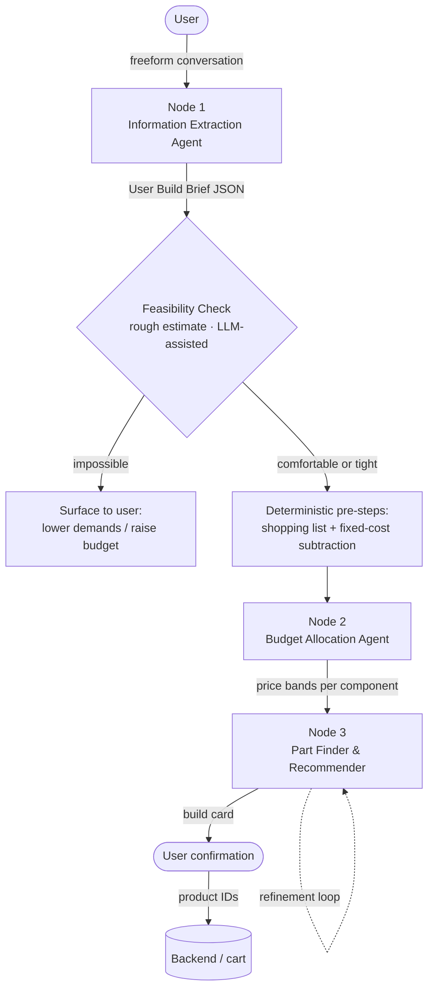
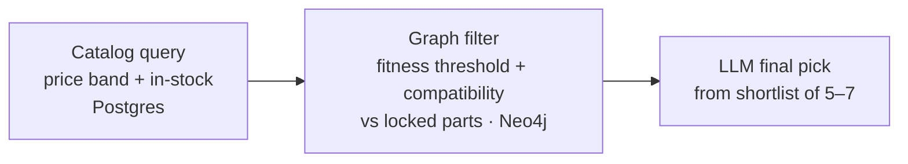

# Karma Advisor — Agentic Workflow Design

> Living design document for the Karma Advisor recommendation pipeline (Karma Computers).
> **Status legend:** 🔒 Locked · 🛠️ Implemented · 🚧 In design · ❓ Open
> _Last updated: 2026-06-26_

---

## 1. System Overview

Karma Advisor is the multi-agent recommendation engine at the center of **Karma Computers**, a B2C e-commerce platform for PC parts and custom builds aimed at Indian consumers. It takes a user's needs expressed in natural language and produces a single, compatible, budget-fit PC build.

The pipeline is **design-first**: every agent is fully scoped and locked before implementation. It runs as a linear flow with one deterministic gate between intake and allocation.



---

## 2. Pipeline Architecture

### 2.1 Node One — Information Extraction Agent 🔒

- **Role:** Conversation-first intake. A set of **predefined, structured questions**, each answered by the user in a **freeform paragraph**. Not dropdowns, not open-ended free chat — fixed questions, paragraph answers.
- **Intake-model decision (conversation-first over wizard):** chosen deliberately. The build-requirement space is combinatorial and cannot be enumerated as wizard branches; conversation is the agentic thesis of the product; and the choice is **reversible** because both intake modes would produce the *identical* Brief — a guided wizard can be added later as additive front-end UI without touching any downstream node.
- **Question flow:**
  - **One question per turn**, but extraction is **opportunistic against the full Brief schema** — anything the user volunteers (even if it answers a later question) is captured immediately and the corresponding questions are skipped.
  - **Questions are static / predefined, not dynamically branched.** A user's answer never changes *which* questions are asked; it only affects downstream nodes. The sole exception is targeted **ask-if-ambiguous** clarifications (e.g. "video editing" → "which software?").
  - **Final question is open-ended**, asked after the others: *"any hard constraints / must-haves / must-nots?"* → populates the pinned `hard_constraints` block (`source: user_stated`).
- **Question set + stop condition:** there is **one finite, pre-prepared set of questions**. By default the agent works through the **entire set**, then locks the Brief — the list itself is the bound (no arbitrary max count). Two stop rules govern this:
  - **Required floor:** **budget + primary use case must be answered before proceeding.** This is the gate — intake cannot move past it without both.
  - **User early exit:** once the floor is met, if the user says "done" / "stop" at any point, intake ends there and the Brief locks immediately.
  - Otherwise (no early exit), every question in the pre-prepared set is asked. _(Supersedes the earlier "stops once budget + primary use case are filled" wording, and replaces the interim "max question count" idea — there is no count, only the fixed set + user stop.)_
- **Extraction + validation:** each paragraph answer → LLM returns JSON against the schema → **two-stage validation**: (1) JSON syntax (`JSON.parse`), (2) schema + enum conformance. Valid → merge into Brief. Malformed / non-conformant → retry then flag (exact retry policy deferred to testing).
- **Output:** Canonical **User Build Brief** JSON (full schema in **Appendix A**).
- **Not responsible for** feasibility or contradiction checking — Node One has no tier/benchmark data; its only jobs are asking questions and forming valid JSON. The Feasibility Check is the arbiter of buildability at budget.

### 2.2 Feasibility Check 🔒

**Role:** Lightweight pre-Node-Two gate. Answers one question before two more nodes run: *can the user's requirements be built within their budget?* Produces a rough estimate — no inventory search, no part selection, no compatibility validation. Those are Node Three's job.

**Three steps:**

1. **Requirements Resolver** — per `software` entry, look up base component floor (what GPU class, how much RAM, etc.), scale by the performance envelope (`resolution`, `framerate`, `hdr`), aggregate across the full workload:
   - GPU tier, CPU tier, VRAM: **max** across software (peak demand wins).
   - Storage: **additive** (workloads stack their capacity needs).
   - RAM: **max** single-app floor, plus a concurrency bump if two or more heavy workloads run simultaneously.
   - Hard constraints that raise the floor (e.g. SFF/ITX form factor, brand exclusions) are folded in here.
   - Reused parts: their cost is zeroed; their constraints (socket, form factor) remain live.

2. **Scope aggregator** — add non-component line-items depending on `budget.scope`: monitor (if unowned and in scope), OS license, must-have peripherals. Subtract reused-part costs.

3. **LLM-assisted cost estimate** — the LLM receives the aggregated floor, the full budget picture, and **one live price anchor pulled from Postgres**: the current minimum catalog price for the binding component (almost always the GPU; sometimes CPU for heavy compute workloads). The LLM reasons about the rest from general knowledge of Indian PC part pricing and returns a verdict with a brief reason.

**Verdict — three-state 🔒:**
- `comfortable` — budget has meaningful headroom above the estimated floor.
- `tight` — buildable but little flexibility; expect compromises.
- `impossible` — floor estimate materially exceeds the ceiling.

**Routing:** `comfortable` or `tight` → proceed to Node Two. `impossible` → Type Two failure: surface to the user with the binding constraint and suggested adjustments (raise budget, lower resolution target, relax form-factor constraint, etc.). Node One Brief is re-entered if the user adjusts.

**What this is not:** the Feasibility Check does not validate a complete build, does not search inventory, and does not pick parts. It is a rough gate — honest about the fact that it is an estimate.

**Known open items:** realistic-min buffer calibration; non-component cost estimates are currently rough; reused-parts compatibility stubs need PC-of-record data from `existing.existing_pc_build_id` (Brief Appendix A).

### 2.3 Node Two — Budget Allocation Agent 🔒

- **Role:** Takes three deterministically compiled, server-side inputs, reasons across them, and outputs price bands per component. No other responsibility.

**Deterministic pre-steps (before the agent runs):**
1. Generate the shopping list by cross-referencing the brief's existing/reused parts against the full component list — only components that need to be purchased proceed.
2. Subtract fixed costs (OS license, specified monitor, peripherals). Node Two only allocates the remaining **core-component pool**.

> The Brief now carries these fixed-cost inputs explicitly — `operating_system`, `monitor`, and `peripherals` sections (Appendix A) — which the fixed-cost subtraction reads.

**Three inputs:**
1. **Default allocation profile** — per-use-case skew predetermined by Karma Computers (gaming → GPU, editing → VRAM + storage, ML → RAM + GPU VRAM, programming → CPU + RAM).
2. **User brief** from Node One.
3. **Software minimum specs** fetched at runtime via web search from authoritative sources (Steam, Epic Games, official vendor pages). Not stored in the knowledge graph.

> **Boundary:** Catalog price floors are *not* a Node Two input. If Node Three can't find a part within a band, it surfaces that to the user — not Node Two's concern.

**Output:** JSON price bands (low / mid / high in INR) per shopping-list component only. Constraints:
- midpoints sum to the core budget target,
- high ends sum to the ceiling,
- low ends sum to the floor.

No rationale, flex flags, or metadata — Node Three has the full brief and derives intent itself. Node Three hunts for components clustered around the midpoints as the sweet spot.

### 2.4 Node Three — Part Finder & Recommender 🔒

**Selection sequence:** GPU → CPU → RAM → Storage → Motherboard → PSU → Case → Cooler → Fans.
_(Motherboard is selected after the performance anchors are locked — it's a compatibility hub, not a constraint driver.)_

**Per-slot selection loop (three-step funnel):**



- **Fitness thresholds** are derived once upfront by the LLM reading the brief, stored in build state, and not re-derived per slot.
- **Safeguards:**
  - Relaxation ladder for empty shortlists (widen band → lower fitness threshold → escalate).
  - Lookahead probes before locking anchor components to prevent downstream dead-ends.
  - Running budget-pool tracking to catch drift across slots.
  - Compatibility validator runs after every lock.
- **Build state carries:** locked parts, derived thresholds, remaining budget, user brief.
- **Output:** A single build (not multiple options). The **build card** is a human-readable summary of parts, prices, and justifications sent to the user for confirmation; product IDs are sent to the backend on confirmation.
- **Failure communication:** plain English (e.g., "your budget cannot support this configuration; either lower demands or increase budget; the best available within constraints is X").

**Refinement loop — Approach B (pin / open model):**
- All slots re-solve on each refinement; the compatibility validator surfaces conflicts conversationally rather than maintaining a dependency graph.
- Budget-level changes are routed through the budget updater (Approach A tier routing).
- Brief-level changes restart at Node One.

---

## 3. Knowledge Graph Design — Neo4j 🔒

**Two edge families:**
1. **Compatibility family** — unweighted junction nodes. Components connect to shared spec nodes (sockets, chipsets) rather than directly to each other.
2. **Fitness family** — weighted edges encoding how well a component serves a specific use case (gaming, video editing, music production, etc.).

**Node taxonomy:** component · spec · use-case · performance · component-class.

**Key choices:**
- **One node per distinct product** (not per chip model) — board-partner variants can differ meaningfully in cooling, noise, and sustained performance.
- **Single database:** Neo4j handles both compatibility and fitness traversal. A Postgres/relational approach for compatibility was evaluated and rejected — the agentic system benefits from traversing both in the same semantic space without context switching. Compatibility edges are weightless but still traversed as graph relationships.

**Pending (next session):** Cypher query patterns, schema implementation, benchmark data sourcing, weight rubric design.

---

## 4. Data Contracts (what moves where)

| Stage | Produces | Shape / notes |
|---|---|---|
| Node One | User Build Brief | JSON; budget + primary use case mandatory; now also carries software/workload, monitor, peripherals, storage, OS, existing/reused parts, and pinned `hard_constraints` — full schema in **Appendix A** |
| Feasibility Check | verdict + reason | `comfortable \| tight \| impossible`; comfortable/tight → proceed to Node Two; impossible → surface to user with binding constraint + suggested adjustments |
| Node Two pre-steps | shopping list + core budget pool | deterministic; fixed costs already subtracted |
| Node Two | price bands | JSON low/mid/high INR per shopping-list component |
| Node Three | build card | human-readable summary; product IDs sent to backend on confirm |

---

## 5. Platform Features 🔒

- **Hidden business-intelligence ranking layer** surfaces high-margin and overstock products without user visibility; admin-configurable via weight controls.
- **Access:** logged-in users only; 2–3 active chat cap (intentional funnel discipline); saved builds uncapped.
- **Two-tier memory:** long-term and short-term with auto-compaction. The durable build object stores product IDs and intent snapshots — **never prices**.
- **Tally ERP integration** via XML/ODBC for bidirectional stock and sales-voucher sync.

---

## 6. Decision Log — the *why*

| Decision | Reasoning |
|---|---|
| Conversation-first intake over guided wizard | Build-requirement space is combinatorial (can't enumerate branches); conversation is the agentic thesis; reversible since both modes emit the identical Brief, so a wizard can be added later as additive UI. |
| Structured questions, freeform paragraph answers | Keeps conversational feel while bounding each turn's scope — easier extraction, cleaner state, lower token use than reverse-engineering one long dump. |
| Static (non-branching) question set | Answers drive downstream nodes, not which questions are asked; avoids the wizard's hand-authored branch explosion. Only exception is ask-if-ambiguous clarifications. |
| Budget + primary use case as the proceed floor | With those two a build estimate is possible; they're the gate to proceed. Everything else is the rest of one fixed pre-prepared set, asked in full unless the user says "done" / "stop" (no arbitrary question cap). |
| Hard constraints captured via a final open-ended question + pinned block | Non-negotiables (no-RGB, SFF, brand bans) live in structured pinned state separate from the prose summary, so they survive compaction and are never re-suggested. |
| Node One does no feasibility/contradiction check | It has no tier/benchmark data; its only jobs are asking and forming valid JSON. Feasibility Check is the arbiter. |
| Motherboard selected after GPU/CPU/RAM | Prevents over-constraining the build; the board adapts to anchors rather than driving them. |
| Fitness thresholds derived once upfront | Avoids redundant per-slot LLM calls; thresholds live in build state. |
| Product-level graph nodes | Board-partner variants of the same chip differ enough in real-world performance to warrant individual nodes. |
| Catalog price floors excluded from Node Two | Allocation reasoning is Node Two's job; finding parts within bands is Node Three's. |
| Neo4j over Postgres for compatibility | Same-semantic-space traversal is worth the architectural simplicity; weightless edges are still valid graph relationships. |
| RAG over fine-tuning | Fine-tuning can't track volatile daily Indian pricing, goes stale on hardware launches, and is a black box. |
| Feasibility Check is LLM-assisted, not LLM-free | Pure determinism would require a complete inventory search to price the floor accurately — that is Node Three's job, not a gate's. An LLM call with one live Postgres price anchor (cheapest binding component) is fast, honest about being a rough estimate, and avoids pulling inventory logic into the wrong stage. |
| Feasibility Check does not search inventory | Finding and validating parts is Node Three's responsibility. The gate only answers "is this roughly buildable in budget?" — not "which parts?" Keeping the boundary clean prevents two nodes doing the same work. |
| One live price anchor (Postgres) injected into the LLM prompt | Indian PC pricing is volatile. The GPU — the most expensive and most volatile component — is anchored to the current catalog minimum price so the estimate doesn't go stale on the one number that matters most. Everything else the LLM reasons about from general knowledge. |
| Supabase as managed Postgres host (not full BaaS) | Fastify handles the API layer, Prisma the ORM. Does not replace Neo4j, Redis, or Meilisearch. |

---

## 7. Open Questions / On the Horizon 🚧

- **Knowledge graph (next session):** Cypher query patterns, Neo4j schema implementation, benchmark data sourcing, weight rubric design.
- **Fitness weights (open ❓):** precise decimals vs coarse buckets? Scope `good_for` weights to use-case alone, or use-case + resolution-tier pairs?
- **Node Three refinement loop:** implementation.
- **Feasibility Check — remaining open items:** realistic-min buffer calibration (how much headroom separates tight from comfortable); non-component cost estimates (currently rough floor values); reused-parts compatibility stubs (need PC-of-record data from `existing.existing_pc_build_id` in Appendix A).
- **Node One retry policy:** exact malformed/non-conformant retry count and escalation path — deferred to testing.
- **Context window management strategy:** flagged as its own dedicated session topic.

---

## 8. Tech Stack

| Layer | Technology |
|---|---|
| AI API | Anthropic Claude API (tool calling) |
| Relational DB / product catalog | Supabase (managed Postgres) |
| ORM | Prisma |
| API layer | Fastify |
| Knowledge graph | Neo4j |
| Session / short-term memory | Redis |
| Product search | Meilisearch |
| ERP integration | Tally ERP via XML/ODBC |
| Software specs retrieval | Runtime web search (Steam, Epic Games, official vendor pages) |

---

## Appendix A — User Build Brief schema 🔒

The single structured artifact Node One emits and every downstream stage reads. A **living object**, re-filled in place on send-back / build-edit. **No prices stored.**

**Conventions**
- **Every field carries a `source` flag:** `user_stated | inferred | default_applied | skipped_by_user` — so any node can tell a real answer from an assumption, and re-engagement can target only `inferred` / `skipped` fields.
- **Field tiers:** `required` (blocks lock — the must-ask budget + primary use case), `ask_if_ambiguous`, `optional` (skippable → explicit default).
- **Soft vs hard:** preference fields (purpose, physical, longevity, extras) are soft signals the LLM weighs; the `hard_constraints` block is non-negotiable, **pinned, and never compacted**.

```yaml
# 0 — Envelope
brief_id, user_id, chat_id, build_id, schema_version
status: draft | locked | revisiting
completeness: { required_complete: bool, optional_filled: int, optional_skipped: int }
open_questions: [string]            # drives follow-ups
created_at, updated_at

# 1 — Budget (REQUIRED)
budget:
  currency: INR
  comfortable_min: int
  comfortable_max: int
  ceiling: int                      # max stretch
  scope: pc_only | pc_plus_monitor | pc_plus_peripherals | full_setup
  notes: string | null

# 2 — Purpose (REQUIRED)
purpose:
  primary_use_case: gaming | content_creation | work_productivity | storage_homeserver | general_use
  sub_case: string                  # competitive_fps | open_world_aaa | video_editing | 3d_modeling | music_production | ...
  secondary_use_cases: [ { use_case, weight: low|medium|high } ]

# 3 — Software & workload  — drives requirement floors at the feasibility gate
software:
  - name: string                    # "Red Dead Redemption 2", "Premiere Pro", "Blender", "VS Code"
    category: game | video | 3d | audio | dev | other
    frequency: primary | secondary | occasional
    intensity: casual | moderate | heavy

# 4 — Performance targets (required for gaming, else optional)
performance:
  target_resolution: 1080p | 1440p | 4K | null
  target_framerate: int | "max"
  hdr_wanted: bool                  # default false
  source: <flag>

# 5 — Monitor (single source of truth)
monitor:
  owned: yes | no
  owned_specs: { resolution, refresh_hz, hdr, size_inch } | null   # if owned
  target_specs: { resolution, refresh_hz, hdr } | null             # if not owned and in scope
  count: int                        # default 1
  source: <flag>

# 6 — Peripherals (meaningful only when budget.scope includes peripherals)
peripherals:
  - type: keyboard | mouse | headset | mic | speakers | drawing_tablet | controller | webcam
    requirements: string | null     # "mechanical, low-latency", "high DPI wireless"
    priority: must_have | nice_to_have

# 7 — Storage (Node Two must size this)
storage:
  capacity_gb: int | null
  speed_tier: nvme | sata_ssd | hdd | mixed
  data_profile: cold | warm | hot | mixed
  source: <flag>

# 8 — Operating system (real budget line + affects part selection)
operating_system:
  os: windows | linux | dual_boot | none_reuse
  license: oem | retail | byo | na
  source: <flag>

# 9 — Existing assets & ecosystem (REQUIRED to ask)
existing:
  has_existing_parts: yes | no
  reuse_parts: [ { slot, identifier, action: keep|replace } ]
  existing_pc_build_id: uuid | null # PC-of-record for upgrades
  ecosystem_prefs: { cpu_brand_pref, gpu_brand_pref }   # SOFT

# 10 — Physical & environment (optional → defaults)
physical:
  form_factor_pref: full_tower | atx_mid | compact_matx | sff_itx | no_preference
  noise_tolerance: silent_priority | balanced | dont_care
  placement: open_desk | enclosed_cabinet | hot_room | normal
  portability_need: bool
  size_notes: string | null

# 11 — Reliability & longevity (optional → defaults)
longevity:
  reliability_priority: consumer | high_stability_alwayson | mission_critical
  upgrade_path: future_proof | balanced | set_and_forget
  timeline: buy_now | flexible_for_deals

# 12 — Aesthetics & extras (optional → defaults)
extras:
  rgb_pref: want_rgb | minimal | none | no_preference
  visual_style: showcase_glass | clean_sleeper | no_preference
  connectivity_needs: [wifi | bluetooth | thunderbolt | 10gbe | many_usb]
  specific_part_requests: [ { slot, requested } ]   # SOFT, validated vs live stock

# 13 — Hard constraints (PINNED, never compacted, append-only unless retracted)
hard_constraints:
  must_have:   [ { id, type, value, source: user_stated|derived, locked_at } ]
  must_not:    [ { id, type, value, source, locked_at } ]
  rejected_parts: [ { product_id, reason, rejected_at } ]   # Node Three must never re-surface
```

**Consumer map**

| Stage | Reads |
|---|---|
| Feasibility Check | budget, purpose, software, performance, hard_constraints (size/form-factor raise the floor) |
| Node Two | budget, full purpose, software, performance, monitor + peripherals + OS (fixed-cost subtraction), existing.reuse_parts, longevity, hard_constraints |
| Node Three | everything — esp. software, ecosystem_prefs, extras, connectivity, hard_constraints, rejected_parts, reuse_parts |

**Mutability / re-fill rules**
- Reloaded and updated in place on send-back; `status → revisiting`, `open_questions` repopulated.
- Required fields may be revised but are never null once locked.
- `hard_constraints` accumulate across the session (append-only unless retracted) and are the one block guaranteed to survive compaction.
- Editing a saved build seeds a fresh Brief from the build's `intent_snapshot` + part list.
- A skipped optional field is recorded as `source: default_applied` (or `skipped_by_user`) — never silently assumed.

---

## Maintaining this doc

Keep this file in the Karma Advisor repo (e.g. `/docs/DESIGN.md`). At the end of a design session: paste the current file in, work through decisions, ask for the updated Markdown, paste it back, and commit. Every change is then git-tracked, and any fresh session gets full context from one paste.